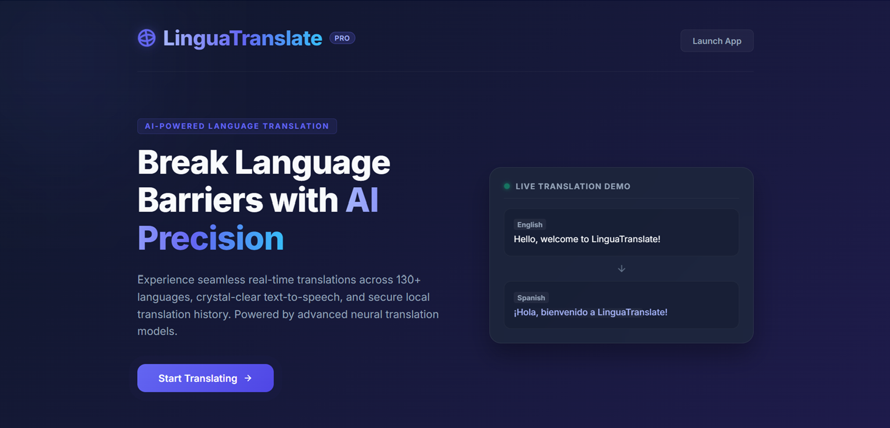
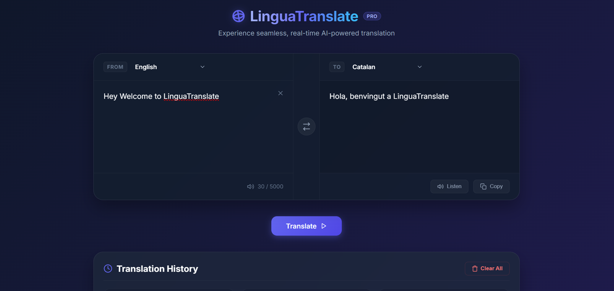
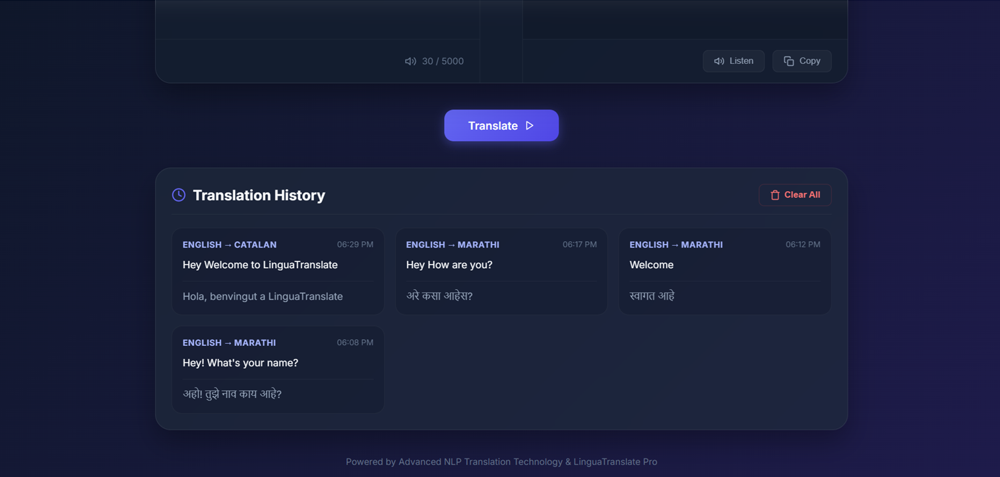

# 🌍 LinguaTranslate - AI Language Translator

## 📌 Project Overview

LinguaTranslate is a web-based AI Language Translation application developed using Python Flask. It allows users to translate text between multiple languages instantly with a simple and user-friendly interface.

This project was developed as part of the CodeAlpha Artificial Intelligence Internship Program.

---

## ✨ Features

* 🌐 Translate text into multiple languages
* 🔄 Language selection (Source & Target)
* 📋 Copy translated text
* 🔊 Listen to translated text using Text-to-Speech
* 🗑️ Clear text option
* 🎨 Modern and responsive user interface
* 📱 Works on desktop and mobile browsers

---

## 🛠️ Technologies Used

* Python
* Flask
* HTML5
* CSS3
* JavaScript
* Deep Translator Library

---

## 📂 Project Structure

AI-Language-Translator/

│

├── app.py

├── requirements.txt

├── README.md

│

├── templates/

│ └── index.html

│

└── static/

└── style.css

---

## 🚀 Installation

### 1. Clone Repository

git clone https://github.com/Vaishnavikenchi/CodeAlpha_LinguaTranslate.git
### 2. Navigate to Project Folder

cd AI-Language-Translator

### 3. Install Dependencies

pip install -r requirements.txt

### 4. Run Application

python app.py

### 5. Open Browser

http://127.0.0.1:5000

---

## 🎯 How It Works

1. Enter text in the source text area.
2. Select source language.
3. Select target language.
4. Click the Translate button.
5. View translated output instantly.
6. Use Copy or Listen features if needed.

---

## 📸 Screenshots

### Home Page

### Translation Example

### Listen Feature

---

## 🎥 Project Demo Video

The project demo video is available in the repository:
 Screenshots/Video Project.mp4

## 🎓 Internship Information

Project completed under:

CodeAlpha Artificial Intelligence Internship

Task: AI Language Translator

---

## 👩‍💻 Author

Vaishnavi Kenchi

Artificial Intelligence Intern - CodeAlpha

---

## 📜 License

This project is developed for educational and internship purposes.
